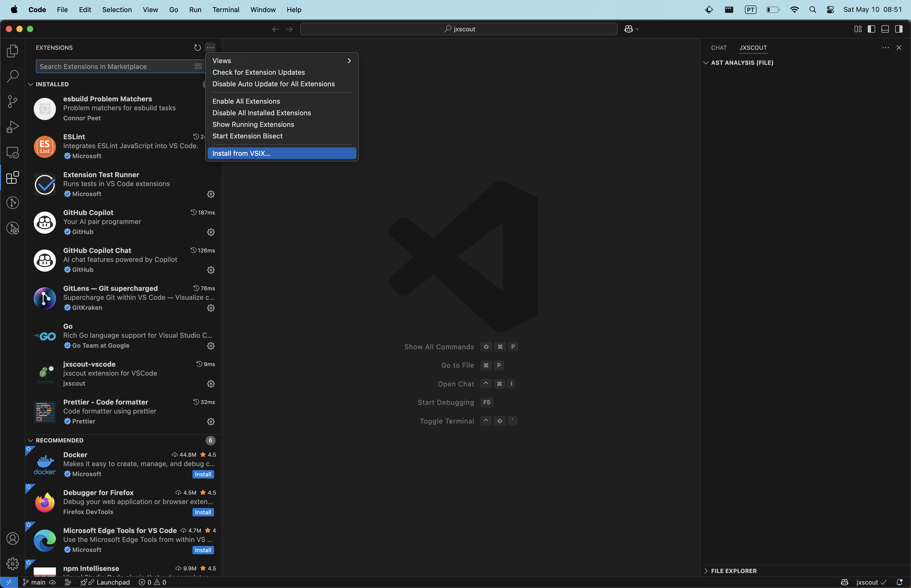

# jxscout-vscode

A VSCode extension for integrating with [jxscout](https://github.com/francisconeves97/jxscout), a tool that automatically saves JS files and performs AST analysis.

## Features

- Visualize references to behavior interesting for security researchers
- Copy paths, query parameters, and hostnames for brute forcing
- TODO: Project-level visualization of discoveries
- TODO: Project-level navigation of assets
- TODO: Visualization of relationships between HTML, JS, and Source Maps

## Demo

https://github.com/user-attachments/assets/3b086005-f105-41a1-8741-faa26c17d8d0

## Installation

1. Download the latest `.vsix` file from the [releases](https://github.com/francisconeves97/jxscout-vscode/releases) page
2. In VSCode, open the extensions sidebar menu
3. Click the three dots at the top and select "Install from VSIX..."
4. Select the `.vsix` file you just downloaded

## Configuration

The extension can be configured through VSCode settings:

| Setting              | Description                              | Default     |
| -------------------- | ---------------------------------------- | ----------- |
| `jxscout.serverHost` | Hostname of the jxscout WebSocket server | `localhost` |
| `jxscout.serverPort` | Port of the jxscout WebSocket server     | `3333`      |

## Usage

1. Open a JavaScript file in VSCode
2. The extension will automatically connect to the jxscout server and request analysis
3. Analysis results will be displayed in the jxscout Analysis panel

## Requirements

- A running jxscout server (version >=0.7.0)

## License

This project is licensed under the MIT License - see the LICENSE file for details.

## Contributing

Feel free to leave suggestions and open pull requests - all contributions are welcome!

## Support

Happy hunting! 🐛 If jxscout helped you find cool bugs, [consider buying me a coffee](https://ko-fi.com/francisconeves97)! ☕

## License

This project is licensed under the GNU General Public License. See the COPYING file for the full license text.
